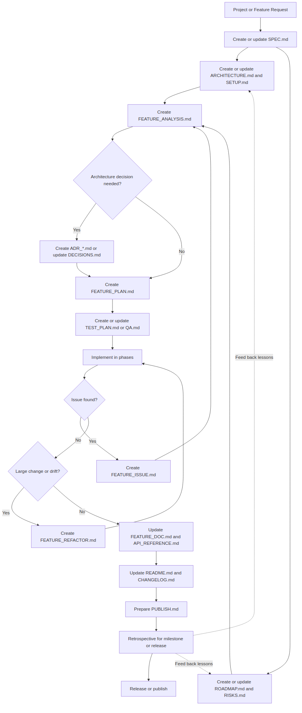
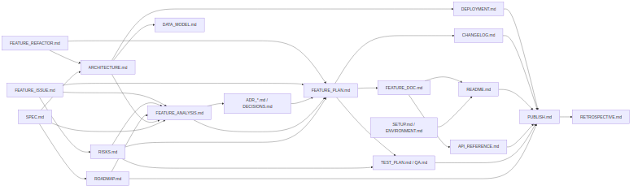
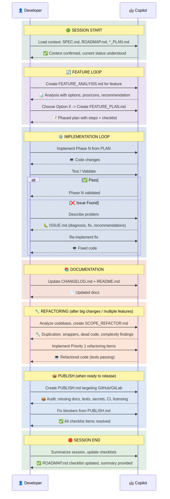

# AI Development Workflow

Workflow Version: 0.1.0

The repository release version and workflow package version are currently the same contract.

## Table of Contents

- [Purpose](#purpose)
- [Usage](#usage)
- [Core Principles](#core-principles)
- [High-Level Workflow](#high-level-workflow)
- [Document Flow Diagram](#document-flow-diagram)
- [Interaction Model With Copilot](#interaction-model-with-copilot)
- [Typical Session Sequence Diagram](#typical-session-sequence-diagram)
- [Standard Prompt Pattern](#standard-prompt-pattern)
- [Workflow Stages](#workflow-stages)
- [Required Documents](#required-documents)
  - [SPEC.md](#specmd)
  - [ROADMAP.md](#roadmapmd)
  - [ARCHITECTURE.md](#architecturemd)
  - [SETUP.md or ENVIRONMENT.md](#setupmd-or-environmentmd)
  - [RISKS.md](#risksmd)
  - [*_ANALYSIS.md](#_analysismd)
  - [*_PLAN.md](#_planmd)
  - [ADR_*.md or DECISIONS.md](#adr_md-or-decisionsmd)
  - [TEST_PLAN.md or QA.md](#test_planmd-or-qamd)
  - [*_ISSUE.md](#_issuemd)
  - [*_REFACTOR.md](#_refactormd)
  - [README.md](#readmemd)
  - [API_REFERENCE.md](#api_referencemd)
  - [CHANGELOG.md](#changelogmd)
  - [<FEATURE>_DOC.md](#feature_docmd)
  - [PUBLISH.md](#publishmd)
  - [DEPLOYMENT.md](#deploymentmd)
  - [DATA_MODEL.md](#data_modelmd)
  - [RETROSPECTIVE.md](#retrospectivemd)
- [Quality and Review](#quality-and-review)
- [Session Management](#session-management)
- [Source Control Conventions](#source-control-conventions)
- [Document Registry](#document-registry)
- [Checklist and Status Tracking](#checklist-and-status-tracking)
- [Document Tiers](#document-tiers)
- [Document Status Metadata](#document-status-metadata)
- [Recommended Naming Conventions](#recommended-naming-conventions)
- [Governance Rules](#governance-rules)
- [Prompt Reference](#prompt-reference)
- [Quick-Start Command Prompts](#quick-start-command-prompts)
- [Final Recommendation](#final-recommendation)

## Purpose

This document formalizes how to work with Copilot during project development so that each stage produces clear artifacts, repeatable prompts, and auditable decisions.

The workflow is designed to:

- standardize how requests are given to Copilot
- define which documents should be created at each phase
- keep analysis, planning, implementation, and publishing aligned
- reduce ad hoc decisions during long development sessions
- make project state understandable from documentation alone

## Usage

This document is the full reference. For daily development, generate a compact version that fits within AI assistant context limits.

Use this prompt to generate a compact workflow reference:

```text
Read WORKFLOW.md and generate a compact reference version (~130-180 lines) that includes: core principles, workflow sequence, document registry table with dependencies, document tiers, standard prompt pattern, prompt reference table (one-liners), session start/end prompts, governance rules, key rules (checklist scoping, skip/escalation criteria, cross-document routing, content constraints), document metadata format, and source control conventions. Exclude minimum structures (available in templates/), mermaid diagrams, detailed per-document sections, and verbose quick-start prompts.
```

Recommended output targets:

| Target | Purpose |
|--------|---------|
| `COMPACT_WORKFLOW.md` | Compact reference for manual use with Claude or other AI assistants |
| `.github/prompts/workflow.prompt.md` | Workflow rules loaded by GitHub Copilot in VS Code via prompt file |

Regenerate the compact version whenever WORKFLOW.md changes materially.

### Refresh diagrams

Edit the Mermaid source files in `diagrams/*.mmd`, then run the `Export Mermaid diagrams` VS Code task or execute `scripts/export-mermaid-diagrams.ps1` from the repository root.

The `.mmd` files are the canonical diagram source. The script regenerates the committed `.png` outputs used by the markdown documents. It uses `mmdc` when available and falls back to `npx --yes @mermaid-js/mermaid-cli`.

### Bootstrap a new project

Choose the package that fits how much workflow support you want in the target repository:

1. **Minimal package**
  - `.github/prompts/workflow.prompt.md` — workflow guardrails for Copilot
  - `templates/` — canonical scaffold files for document generation
2. **Enhanced package**
  - everything in the minimal package
  - `COMPACT_WORKFLOW.md` — human quick reference and optional manual workflow context
3. **Advanced package**
  - everything in the enhanced package
  - `.github/prompts/` — reusable on-demand workflow prompts that should not be always-on

If you want a single-folder copy, bundle the `.github/` contents together and optionally place `templates/` under `.github/templates/` for transport, but keep repo-root `templates/` as the canonical default layout when the workflow is installed.

When prompt files are installed, run `/bootstrap-workflow` to generate the initial documentation set. Otherwise, use the project bootstrap prompt manually.

## Core Principles

1. Every major change starts from a written artifact, not from direct coding.
2. Analysis comes before planning, and planning comes before implementation.
3. Each artifact must have an owner, status, date, and clear next action.
4. Decisions that affect architecture, scope, or behavior must be recorded.
5. Large features should be traceable across `SPEC`, `ANALYSIS`, `PLAN`, implementation, and release notes.
6. Checklists are used to track execution status, not to replace technical content.

## High-Level Workflow



Source: [diagrams/01_high_level_workflow.mmd](diagrams/01_high_level_workflow.mmd)

## Document Flow Diagram



Source: [diagrams/02_document_flow.mmd](diagrams/02_document_flow.mmd)

## Interaction Model With Copilot

Use Copilot as a structured collaborator in this sequence:

1. Context building
2. Baseline documentation drafting
3. Option analysis
4. Decision recording
5. Plan decomposition
6. Validation planning
7. Implementation execution
8. Issue investigation
9. Documentation reconciliation
10. Release readiness review
11. Retrospective capture

For each step, explicitly tell Copilot:

- objective
- source documents to use
- expected output file
- required structure
- constraints and assumptions
- whether to analyze only or also edit files

## Typical Session Sequence Diagram



Source: [diagrams/03_session_sequence.mmd](diagrams/03_session_sequence.mmd)

## Standard Prompt Pattern

Use this prompt structure for all requests:

```text
Task: <what needs to be produced>
Goal: <why this is needed>
Inputs: <files, requirements, decisions, constraints>
Output: <target file name>
Format: <required sections, checklist, table, diagram>
Rules: <quality bar, exclusions, assumptions>
Action: <analyze only | draft doc | update code and docs>
```

Example:

```text
Task: Prepare FEATURE_ANALYSIS.md for authentication redesign.
Goal: Compare implementation options before coding.
Inputs: SPEC.md, ROADMAP.md, current auth module, recent issues.
Output: AUTH_ANALYSIS.md
Format: Context, problem statement, options, trade-offs, recommendation, risks, checklist.
Rules: Include at least 3 options and a final recommendation.
Action: Draft the document only.
```

## Workflow Stages

| Stage | Purpose | Primary Inputs | Primary Outputs |
|-------|---------|----------------|-----------------|
| 1. Start Project | Establish project scope and baseline documents | Raw requirements, source code, stakeholder constraints | `SPEC.md`, `ARCHITECTURE.md`, `SETUP.md`, `ROADMAP.md`, `RISKS.md`, initial `README.md` |
| 2. Analyze Feature or Change | Turn an idea, issue, or roadmap item into options and a recommendation | `SPEC.md`, `ROADMAP.md`, existing implementation, issue descriptions | `*_ANALYSIS.md`, optional `ADR_*.md` or `DECISIONS.md` |
| 3. Plan Implementation | Build a phased execution plan with sequencing and acceptance criteria | `*_ANALYSIS.md`, `ADR_*.md` or `DECISIONS.md`, related issues | `*_PLAN.md`, `TEST_PLAN.md` or `QA.md` |
| 4. Implement and Validate | Execute the plan and keep code, docs, and checklists synchronized | `*_PLAN.md`, source code, tests | Code changes, updated checklists, feature docs, `CHANGELOG.md` |
| 5. Quality and Review | Verify implementation quality before completion or release | `*_PLAN.md`, `TEST_PLAN.md` or `QA.md`, implemented changes | Test additions, review findings, security findings, follow-up artifact updates |
| 6. Capture Issues and Refactor Needs | Preserve debugging lessons and structural cleanup work | Failed attempts, runtime or design issues, degraded code areas | `*_ISSUE.md`, `*_REFACTOR.md`, possible `RISKS.md` updates |
| 7. Publish and Release | Verify release readiness and public-facing documentation | Prior artifacts, repository state, test status, release target | `PUBLISH.md`, final docs, `RETROSPECTIVE.md` |

### 1. Start Project

This stage establishes project scope and baseline documents.

#### Inputs

- raw requirements
- existing source code, if any
- stakeholder constraints
- target platform and delivery expectations

#### Outputs

- `SPEC.md`
- `ARCHITECTURE.md`
- `SETUP.md` or `ENVIRONMENT.md`
- `ROADMAP.md`
- `RISKS.md`
- initial `README.md`

### 2. Analyze Feature or Change

This stage converts an idea, issue, or roadmap item into options and a recommendation.

#### Inputs

- `SPEC.md`
- `ROADMAP.md`
- existing implementation
- issue descriptions
- previous plans or analyses

#### Outputs

- `*_ANALYSIS.md`
- `ADR_*.md` or `DECISIONS.md`, if a design decision is required

### 3. Plan Implementation

This stage creates a phased execution plan with acceptance criteria and sequencing.

#### Inputs

- `*_ANALYSIS.md`
- `ADR_*.md` or `DECISIONS.md`
- related issue documents
- relevant architecture constraints

#### Outputs

- `*_PLAN.md`
- `TEST_PLAN.md` or `QA.md`

### 4. Implement and Validate

This stage executes the plan and keeps code, docs, and checklists synchronized.

#### Inputs

- `*_PLAN.md`
- source code
- tests

#### Outputs

- code changes
- updated plan checklist
- updated test or QA checklist
- updated feature docs
- updated `CHANGELOG.md`

### 5. Quality and Review

This stage verifies implementation quality before work is treated as complete or ready for release.

#### Inputs

- `*_PLAN.md`
- `TEST_PLAN.md` or `QA.md`
- implemented code changes
- automated and manual test results

#### Outputs

- additional or corrected tests
- review findings
- security findings or follow-up tasks
- updated plan, risk, issue, or refactor artifacts when problems are found

### 6. Capture Issues and Refactor Needs

This stage prevents lessons from being lost during debugging or large-scale changes.

#### Inputs

- failed implementation attempts
- runtime or design issues
- duplicated or degraded code areas

#### Outputs

- `*_ISSUE.md`
- `*_REFACTOR.md`
- updates to `RISKS.md`, when risk level changes

### 7. Publish and Release

This stage verifies release readiness and public-facing documentation.

#### Identity and Release Contract

- treat branding as a one-time strategic identity decision handled during publish preparation or pre-publish hardening
- treat versioning as a cross-cutting rule that may be defined earlier, but enforce and reconcile it during publish across visible docs, release artifacts, and repository metadata
- capture repository identity decisions such as published name, slug, description, topics, and outward-facing positioning in publish artifacts when they matter for release readiness

#### Inputs

- all previous artifacts
- repository state
- test status
- release target

#### Outputs

- `PUBLISH.md`
- final `README.md`
- final `API_REFERENCE.md`
- final `CHANGELOG.md`
- `RETROSPECTIVE.md` for milestone or release review

## Required Documents

The files in [templates/](templates/) are the canonical scaffolds for each document type. The sections below define when to use each artifact, what depends on it, and any workflow-specific rules; use the linked template file instead of copying a document structure from this guide.

When a section allows alternate names such as `ENVIRONMENT.md`, `DECISIONS.md`, or `QA.md`, reuse the linked template and rename or adapt the output file to match the project convention.

### SPEC.md

#### Purpose

Defines what the project or feature should do.

#### Dependencies

- **Requires:** none (root document)
- **Required by:** `ARCHITECTURE.md`, `ROADMAP.md`, `*_ANALYSIS.md`

#### When to create

- at project start
- when onboarding an existing codebase
- when a major feature changes scope

#### Template

Use [templates/SPEC.md](templates/SPEC.md) as the canonical scaffold.

#### Standard prompts

From existing project:

```text
Prepare SPEC.md for this existing project by analyzing the current source code, project structure, and available documentation. Summarize what the system does, define functional and non-functional requirements, identify constraints and missing clarifications, and produce a clean SPEC.md.
```

From raw requirements:

```text
Prepare SPEC.md for my project based on these requirements: <paste requirements>. Structure it with goals, non-goals, functional requirements, non-functional requirements, constraints, dependencies, acceptance criteria, and open questions.
```

### ROADMAP.md

#### Purpose

Defines major delivery phases and tracks progress at project level.

#### Dependencies

- **Requires:** `SPEC.md`
- **Required by:** `*_ANALYSIS.md`, `PUBLISH.md`

#### Template

Use [templates/ROADMAP.md](templates/ROADMAP.md) as the canonical scaffold.

#### Rules

- keep roadmap items outcome-oriented
- use phases or milestones, not low-level tasks
- finish with a checklist for tracking status

#### Standard prompt

```text
Create ROADMAP.md for this project based on SPEC.md and the current codebase. Organize the roadmap by milestones and phases, identify dependencies and risks, and add a checklist at the end to track completion.
```

### ARCHITECTURE.md

#### Purpose

Captures stable system structure so design discussions and feature analysis start from an explicit architecture model.

#### Dependencies

- **Requires:** `SPEC.md`, `*_REFACTOR.md`
- **Required by:** `*_ANALYSIS.md`, `DEPLOYMENT.md`, `DATA_MODEL.md`

#### Template

Use [templates/ARCHITECTURE.md](templates/ARCHITECTURE.md) as the canonical scaffold.

#### Rules

- keep it stable and system-level, not release-level
- update it when module boundaries or data flow change
- link related ADRs or decision records
- include the Data Model section for projects with persistent storage, schemas, or complex domain entities; omit it for stateless or trivially simple data
- for data-heavy projects where the Data Model section grows large, extract it into a standalone `DATA_MODEL.md` and reference it from here
- include the Observability section for projects that deploy to any environment; cover logging, metrics, health checks, and alerting; omit it for local-only tools or libraries

#### Standard prompt

```text
Prepare ARCHITECTURE.md for this project by analyzing the current codebase and existing documentation. Describe the system overview, main modules, boundaries, data flow, data model (if the project has persistent storage or complex domain entities), observability approach (logging, metrics, health checks, alerting — if the project deploys beyond local), integration points, key technical decisions, and known weak spots.
```

### SETUP.md or ENVIRONMENT.md

#### Purpose

Documents how to prepare a working development environment when setup is non-trivial.

#### Dependencies

- **Requires:** none
- **Required by:** `README.md`

#### Template

Use [templates/SETUP.md](templates/SETUP.md) as the canonical scaffold. If the project prefers `ENVIRONMENT.md`, keep the same structure and rename the output file.

#### Rules

- include exact local prerequisites
- document secrets handling without exposing secrets
- keep troubleshooting focused on recurring setup failures

#### Standard prompt

```text
Prepare SETUP.md for this project. Describe prerequisites, installation steps, required environment variables, local services, common development commands, and recurring setup issues based on the current repository.
```

### RISKS.md

#### Purpose

Tracks important technical, delivery, dependency, and security risks separately from roadmap planning.

#### Dependencies

- **Requires:** `*_ISSUE.md`
- **Required by:** `*_ANALYSIS.md`, `*_PLAN.md`, `TEST_PLAN.md`

#### Template

Use [templates/RISKS.md](templates/RISKS.md) as the canonical scaffold.

#### Rules

- update when implementation, dependencies, or release conditions change
- record mitigation owner and next review point when possible

#### Standard prompt

```text
Create or update RISKS.md for this project. Identify current technical, delivery, dependency, and security risks, estimate impact, document mitigations, and mark which risks require monitoring during implementation or release.
```

### *_ANALYSIS.md

#### Purpose

Explores options for a feature, issue, roadmap item, plan revision, or design decision.

#### Dependencies

- **Requires:** `SPEC.md`, `ARCHITECTURE.md`, `ROADMAP.md`, `RISKS.md`, `*_ISSUE.md`
- **Required by:** `ADR_*.md`, `*_PLAN.md`

#### Naming

- `AUTH_ANALYSIS.md`
- `EXPORT_PIPELINE_ANALYSIS.md`
- `CACHE_INVALIDATION_ANALYSIS.md`

#### Template

Use [templates/FEATURE_ANALYSIS.md](templates/FEATURE_ANALYSIS.md) as the canonical scaffold.

#### Rules

- include at least 2 to 3 options
- identify the upstream source artifact, issue, roadmap item, or plan step that triggered the analysis
- state why the recommendation wins
- record the final approved decision explicitly after review when one is made
- identify cost, complexity, and migration impact
- finish with a checklist that tracks the decision lifecycle, not implementation steps — for example: options evaluated, option chosen (state which), ADR created, implementation plan created
- do not duplicate implementation-level tasks that belong in `*_PLAN.md`

#### When to skip

Skip analysis and proceed directly to `*_PLAN.md` when **all** of the following are true:

- the feature is well-understood with no design ambiguity
- no architectural decision is needed
- the work fits within a single implementation phase
- the risk is low and isolated to one module
- an existing plan or spec section already describes the approach

When skipping, create a `*_PLAN.md` directly or track the work as a ROADMAP checklist item.

#### Standard prompt

```text
Create <FEATURE>_ANALYSIS.md for <feature or issue> using SPEC.md, ROADMAP.md, related plans, issues, and the current implementation. Include Source and Decision sections, compare multiple options, evaluate trade-offs, provide a recommendation, and add a high-level checklist tracking the decision lifecycle (options evaluated, option chosen with name, ADR created if needed, implementation plan created). Do not include implementation-level tasks in the analysis checklist.
```

### *_PLAN.md

#### Purpose

Transforms a recommendation into a phased execution plan.

#### Dependencies

- **Requires:** `*_ANALYSIS.md`, `ADR_*.md`, `RISKS.md`, `*_ISSUE.md`, `*_REFACTOR.md`
- **Required by:** `TEST_PLAN.md`, `<FEATURE>_DOC.md`, `CHANGELOG.md`

#### Naming

- `AUTH_PLAN.md`
- `EXPORT_PIPELINE_PLAN.md`

#### Template

Use [templates/FEATURE_PLAN.md](templates/FEATURE_PLAN.md) as the canonical scaffold.

#### Rules

- phases should be sequential and testable
- each phase should define expected outputs
- identify which analysis, spec section, roadmap item, or issue produced the plan
- state the chosen implementation approach before listing phases
- call out dependencies and concrete risk mitigations explicitly
- include validation strategy, not only tasks
- define what must be true for the feature to be complete
- end with a checklist for implementation tracking

#### Standard prompt

```text
Create a phased <FEATURE>_PLAN.md for <feature> based on <FEATURE>_ANALYSIS.md. Include Source, Chosen Approach, Dependencies, and Risks & Mitigations as explicit sections, then break the work into sequential implementation phases, define validation for each phase, and add a checklist at the end to track progress.
```

### ADR_*.md or DECISIONS.md

#### Purpose

Records architecture and design decisions that should remain visible after the analysis phase.

#### Dependencies

- **Requires:** `*_ANALYSIS.md`
- **Required by:** `*_PLAN.md`

#### Naming

- `ADR_001_AUTH_STRATEGY.md`
- `ADR_002_DEPLOYMENT_MODEL.md`
- `DECISIONS.md`

#### Template

Use [templates/ADR.md](templates/ADR.md) as the canonical scaffold. If the project keeps a single `DECISIONS.md` file, reuse the same decision structure as a repeated entry format.

#### Rules

- create a decision record when a choice affects architecture, deployment, interfaces, or long-term maintenance
- do not hide major technical decisions only inside analysis documents

#### Standard prompt

```text
Create an ADR for the selected design decision from <FEATURE>_ANALYSIS.md. Record the context, chosen decision, alternatives considered, consequences, status, and links to related plan or architecture documents.
```

### TEST_PLAN.md or QA.md

#### Purpose

Defines how features and releases are validated before being considered complete.

#### Dependencies

- **Requires:** `*_PLAN.md`, `RISKS.md`
- **Required by:** `PUBLISH.md`

#### Template

Use [templates/TEST_PLAN.md](templates/TEST_PLAN.md) as the canonical scaffold. If the project uses `QA.md`, keep the same structure and rename the output file.

#### Rules

- align test scope with feature scope and risk level
- include both automated and manual validation where relevant
- update when acceptance criteria or risky behavior changes

#### Standard prompt

```text
Prepare TEST_PLAN.md for <feature or release> based on SPEC.md, the related implementation plan, and known risks. Define unit, integration, end-to-end, and manual validation coverage, along with exit criteria and known testing gaps.
```

## Quality and Review

### Purpose

Provides a repeatable operational pass for testing, review, and security checks after implementation and before completion or release.

### When to use

- after a plan phase is implemented
- before marking a feature or milestone complete
- before publishing or handing work off for review
- whenever risky changes affect security, data flow, or external interfaces

### Review areas

- correctness against the approved plan and acceptance criteria
- test completeness across happy path, edge cases, and failure modes
- code quality, maintainability, and obvious performance regressions
- security risks in authentication, authorization, input handling, secrets, and dependency usage

### Standard prompts

| Scenario | Prompt |
|----------|--------|
| Generate tests | `Write tests for <component or feature> covering the main flow, edge cases, failure paths, and any behavior called out in <FEATURE>_PLAN.md or TEST_PLAN.md.` |
| Review coverage gaps | `Analyze the current tests for <module or feature>. Identify untested paths, weak assertions, missing edge cases, and the highest-value additional tests to add.` |
| Review changes from this session | `Review the changes made in this session against <FEATURE>_PLAN.md and related risks. Check for bugs, incorrect assumptions, missing validation, maintainability issues, and regressions.` |
| Perform security review | `Perform a security review of <component or feature>. Check for authentication and authorization flaws, unsafe input handling, secret exposure, dependency risk, and common OWASP-style vulnerabilities.` |

### Rules

- use this section as an execution pass, not as a replacement for `TEST_PLAN.md` or `QA.md`
- turn important findings into updates to `RISKS.md`, `*_ISSUE.md`, or `*_REFACTOR.md`
- do not mark work complete if major review findings remain unresolved or untracked

### *_ISSUE.md

#### Purpose

Captures issues encountered during a session so debugging effort and design lessons are preserved.

#### Dependencies

- **Requires:** none (created from debugging)
- **Required by:** `*_ANALYSIS.md`, `*_PLAN.md`, `RISKS.md`

#### Naming

- `AUTH_CALLBACK_ISSUE.md`
- `BUILD_PIPELINE_ISSUE.md`

#### Template

Use [templates/FEATURE_ISSUE.md](templates/FEATURE_ISSUE.md) as the canonical scaffold.

#### Rules

- prefer root cause over symptom description
- record failed attempts if they are informative
- explicitly say whether this was a design, implementation, or process issue
- classify the issue so repeated patterns can be grouped across sessions
- record impact severity and affected components explicitly when known
- keep `*_ISSUE.md` focused on diagnosis and follow-up guidance, not as the primary checklist tracker for execution work
- if an issue creates actionable implementation tasks, move those tracked items into the related `*_PLAN.md`, `*_ANALYSIS.md`, `*_REFACTOR.md`, `ROADMAP.md`, or `PUBLISH.md`
- capture lessons learned when the issue reveals a reusable engineering or workflow insight

#### Standard prompt

```text
Create <ISSUE>_ISSUE.md for the problem encountered during this session. Document the symptoms, root cause, what was tried, what was fixed, category, severity, affected components, recommendations, lessons learned, whether this reflects a project design issue, and what alternative options remain.
```

### *_REFACTOR.md

#### Purpose

Defines cleanup work after multiple features or significant architectural drift.

#### Dependencies

- **Requires:** none (created from code review)
- **Required by:** `*_PLAN.md`, `ARCHITECTURE.md`

#### Naming

- `AUTH_REFACTOR.md`
- `API_LAYER_REFACTOR.md`

#### Template

Use [templates/FEATURE_REFACTOR.md](templates/FEATURE_REFACTOR.md) as the canonical scaffold.

#### Rules

- focus on maintainability, duplication, cohesion, and unnecessary wrappers
- use concrete findings tables when possible so refactor work is tied to specific code locations and problems
- prefer incremental refactor steps
- separate high-impact items from lower-priority cleanup so execution order is clear
- finish with a completion checklist

#### Continuous vs documented refactoring

Not all refactoring needs a document. Use this guide to decide:

**Continuous refactoring (no document needed):**

- renaming for clarity
- extracting a method within the same file
- removing obvious dead code encountered during implementation
- simplifying a conditional or loop during a code change
- fixing a style inconsistency while editing nearby code

**Documented refactoring (create `*_REFACTOR.md`):**

- multi-file or multi-module cleanup
- changing architectural patterns or module boundaries
- removing or consolidating shared abstractions
- addressing accumulated technical debt across features
- refactoring triggered by repeated issues or failed implementations

#### Standard prompt

```text
Analyze the existing source code for <area or feature> and prepare <AREA>_REFACTOR.md. Include findings tables for duplication, wrappers or too-small functions, inconsistent patterns, dead code, and complexity hotspots, then produce a prioritized incremental refactor plan with a checklist.
```

### README.md

#### Purpose

Explains the project to humans quickly.

#### Dependencies

- **Requires:** `SETUP.md`, `<FEATURE>_DOC.md`
- **Required by:** `PUBLISH.md`

#### Template

Use [templates/README.md](templates/README.md) as the canonical scaffold.

#### Standard prompt

```text
Prepare README.md for this project based on SPEC.md, the current implementation, and available project documentation. Keep it concise, practical, and accurate for new developers and users.
```

### API_REFERENCE.md

#### Purpose

Describes interfaces exposed by the system.

#### Dependencies

- **Requires:** `<FEATURE>_DOC.md`
- **Required by:** `PUBLISH.md`

#### Template

Use [templates/API_REFERENCE.md](templates/API_REFERENCE.md) as the canonical scaffold.

#### Standard prompt

```text
Prepare API_REFERENCE.md for this project by analyzing the implemented API surface, request and response formats, authentication model, error handling, and usage examples.
```

### CHANGELOG.md

#### Purpose

Tracks meaningful project changes over time.

#### Dependencies

- **Requires:** `*_PLAN.md`
- **Required by:** `PUBLISH.md`

#### Template

Use [templates/CHANGELOG.md](templates/CHANGELOG.md) as the canonical scaffold.

#### Rules

- update during implementation, not only at release time
- describe user-visible or developer-relevant changes

#### Standard prompt

```text
Update CHANGELOG.md based on the implemented changes in this session. Group entries under Added, Changed, Fixed, and Removed, and keep the notes concise and release-oriented.
```

### <FEATURE>_DOC.md

#### Purpose

Provides focused documentation for a specific feature, format, workflow, or interaction model.

#### Dependencies

- **Requires:** `*_PLAN.md`
- **Required by:** `README.md`, `API_REFERENCE.md`

#### Naming examples

- `AUTH_DOC.md`
- `IMPORT_FORMAT_DOC.md`
- `WORKFLOW_ENGINE_DOC.md`

#### Template

Use [templates/FEATURE_DOC.md](templates/FEATURE_DOC.md) as the canonical scaffold.

#### Standard prompt

```text
Prepare <FEATURE>_DOC.md for <feature or format>. Explain the purpose, concepts, data flow or user interaction, configuration, examples, limitations, and edge cases based on the current implementation and project specifications.
```

### PUBLISH.md

#### Purpose

Defines release and repository readiness before publishing to GitHub, GitLab, or another distribution target. For deployment pipeline details, see `DEPLOYMENT.md`.

#### Dependencies

- **Requires:** `ROADMAP.md`, `TEST_PLAN.md`, `API_REFERENCE.md`, `README.md`, `CHANGELOG.md`, `DEPLOYMENT.md`
- **Required by:** `RETROSPECTIVE.md`

#### Template

Use [templates/PUBLISH.md](templates/PUBLISH.md) as the canonical scaffold.

#### Identity and Release Contract

- use this document to record publish-time identity decisions such as repository name, slug, description, topics, and outward-facing positioning when they affect release readiness
- treat branding as a strategic publish concern
- treat versioning as a cross-cutting rule, with this document acting as the release checkpoint that verifies alignment across `VERSION`, `CHANGELOG.md`, visible workflow-version markers, tags, and repository metadata

#### Public repository support files and settings

When the repository will be public, explicitly review whether these supporting artifacts and settings are needed:

- `CONTRIBUTING.md` for contribution workflow and expectations
- `CODE_OF_CONDUCT.md` for community behavior expectations
- `SECURITY.md` for vulnerability reporting instructions
- issue templates and pull request templates
- repository description, topics, and other discoverability settings
- default branch protection and required checks
- CI status badges in `README.md`, when used

#### Standard prompt

```text
Prepare PUBLISH.md for this project. Identify missing features, documentation gaps, publish-time identity decisions, versioning readiness, public repository support files, test coverage expectations, repository cleanup tasks, CI or CD requirements, licensing needs, repository settings, and the exact steps required to publish the repository safely.
```

### DEPLOYMENT.md

#### Purpose

Documents how the project is deployed to target environments, including CI/CD pipeline, deployment steps, rollback procedures, and operational monitoring.

#### Dependencies

- **Requires:** `ARCHITECTURE.md`
- **Required by:** `PUBLISH.md`

#### Template

Use [templates/DEPLOYMENT.md](templates/DEPLOYMENT.md) as the canonical scaffold.

#### Rules

- create when the project deploys to any environment beyond local development
- keep environment definitions explicit: name, purpose, URL or target, access method
- document rollback procedure before the first production deployment
- update when environments, pipeline steps, or infrastructure change
- reference from `PUBLISH.md` when both documents exist

#### Standard prompt

```text
Prepare DEPLOYMENT.md for this project. Document target environments, CI/CD pipeline configuration, build and release process, deployment steps, rollback procedure, post-deployment verification, monitoring and alerting, secrets management, and access control.
```

### DATA_MODEL.md

#### Purpose

Documents the project's data model, schema design, entity relationships, and migration strategy. Use as a standalone artifact for data-heavy projects where the ARCHITECTURE.md Data Model section is insufficient.

#### Dependencies

- **Requires:** `ARCHITECTURE.md`
- **Required by:** none

#### Template

Use [templates/DATA_MODEL.md](templates/DATA_MODEL.md) as the canonical scaffold.

#### Rules

- create when the project has persistent storage, complex domain entities, or multiple data stores
- for simple projects, use the Data Model section in ARCHITECTURE.md instead
- include entity-relationship descriptions or diagrams when more than a handful of entities exist
- update when schema changes, new entities are added, or storage strategy changes
- reference from ARCHITECTURE.md when both documents exist

#### Standard prompt

```text
Prepare DATA_MODEL.md for this project. Document the data model overview, entities and their relationships, schema design, data flow between stores, migration and versioning strategy, constraints and validation rules, and storage and persistence approach.
```

### RETROSPECTIVE.md

#### Purpose

Captures lessons after a milestone, major feature, or release so the workflow itself improves over time.

#### Dependencies

- **Requires:** `PUBLISH.md`
- **Required by:** none (feeds back into `ROADMAP.md` and `RISKS.md` via process)

#### Template

Use [templates/RETROSPECTIVE.md](templates/RETROSPECTIVE.md) as the canonical scaffold. Keep it as a single rolling file with dated entries, newest first.

#### Rules

- use one `RETROSPECTIVE.md` file per project with dated sections, not separate files per milestone
- create after major milestones, not after every trivial change
- focus on reusable lessons, not blame
- the retrospective is not the end of the cycle — it is the bridge to the next cycle
- action items from RETROSPECTIVE.md should be added to ROADMAP.md as improvement tasks
- new risks discovered should update RISKS.md
- process changes should update WORKFLOW.md itself or project-specific workflow notes

#### Standard prompt

```text
Prepare RETROSPECTIVE.md for the completed milestone or release. Summarize what worked, what failed, surprises encountered, process improvements, technical follow-up items, and the actions to apply in the next cycle.
```

## Document Status Metadata

Each project document should start with a compact metadata block:

| Field | Expected Value |
|-------|----------------|
| Status | `Draft`, `In Progress`, `Reviewed`, or `Done` |
| Owner | `<name>` |
| Workflow Version | `<x.y.z>` |
| Last Updated | `YYYY-MM-DD` |
| Related | `<other docs>` |
| Traceability | `<upstream -> current -> downstream>` |

Example:

```text
Status: Draft
Owner: <name>
Workflow Version: <x.y.z>
Last Updated: YYYY-MM-DD
Related: <other docs>
Traceability: <upstream -> current -> downstream>
```

Use the value from the repo-root `VERSION` file for `Workflow Version`.

This makes document maturity visible and keeps cross-references explicit.

The Owner or Author field must always be a human name, not an AI tool or assistant name. The human who requested or approved the document is the owner, even when the content was drafted by Copilot.

## Recommended Naming Conventions

| Document Type | Pattern | Example |
|---------------|---------|---------|
| Specification | `SPEC.md` | `SPEC.md` |
| Roadmap | `ROADMAP.md` | `ROADMAP.md` |
| Architecture | `ARCHITECTURE.md` | `ARCHITECTURE.md` |
| Environment Setup | `SETUP.md` or `ENVIRONMENT.md` | `SETUP.md` |
| Risk Register | `RISKS.md` | `RISKS.md` |
| Analysis | `<FEATURE>_ANALYSIS.md` | `AUTH_ANALYSIS.md` |
| Implementation Plan | `<FEATURE>_PLAN.md` | `AUTH_PLAN.md` |
| Issue Record | `<TOPIC>_ISSUE.md` | `DB_CONNECTION_ISSUE.md` |
| Refactor Plan | `<AREA>_REFACTOR.md` | `AUTH_REFACTOR.md` |
| Feature Documentation | `<FEATURE>_DOC.md` | `AUTH_DOC.md` |
| Decision Record | `ADR_###_TITLE.md` or `DECISIONS.md` | `ADR_001_AUTH_STRATEGY.md` |
| API Reference | `API_REFERENCE.md` | `API_REFERENCE.md` |
| Change Log | `CHANGELOG.md` | `CHANGELOG.md` |
| Publish Checklist | `PUBLISH.md` | `PUBLISH.md` |
| Deployment | `DEPLOYMENT.md` | `DEPLOYMENT.md` |
| Data Model | `DATA_MODEL.md` | `DATA_MODEL.md` |
| Retrospective | `RETROSPECTIVE.md` | `RETROSPECTIVE.md` |

- use uppercase snake case for feature-specific document names
- use one feature or area name consistently across related analysis, plan, issue, refactor, and doc files
- keep names short enough to scan quickly but specific enough to distinguish scope

## Session Management

### Purpose

Provides a compact way to start and close a working session without losing context, status, or follow-up work.

### Starting a session

Use this when opening work on a feature, milestone, issue, or follow-up change.

```text
Load context from SPEC.md, ARCHITECTURE.md, ROADMAP.md, and any related analysis, ADR, issue, plan, or test documents.
We are working on <feature, issue, or milestone>.
Current status: <brief status>.
Confirm what is already decided, what is in progress, and what should happen next.
```

### Ending a session

Use this before stopping work so progress, risks, and remaining tasks are captured in the project artifacts.

```text
Summarize this session: what was completed, what is still pending, what changed, and any issues or risks found.
Update the relevant plan checklist, ROADMAP.md, CHANGELOG.md, and any issue, risk, or refactor documents that should reflect the current state.
List the recommended next step for the next session.
```

### Recommended session workflow with Copilot

For each working session:

1. Start by stating the target artifact or implementation goal.
2. Ask Copilot to read existing relevant docs first.
3. Confirm whether `SPEC.md`, `ARCHITECTURE.md`, and `ROADMAP.md` are still current.
4. If requirements are unclear, request analysis before planning.
5. If a major technical choice is needed, create an ADR or update `DECISIONS.md` before implementation.
6. Approve a plan and a validation strategy before asking for code changes.
7. After implementation, update issue, risk, and refactor records if new findings appear.
8. Reconcile feature docs, API docs, setup docs, and `CHANGELOG.md`.
9. At milestone end, capture retrospective notes.

Suggested session prompt:

```text
Read the relevant project documents first, especially SPEC.md, ARCHITECTURE.md, ROADMAP.md, and any related analysis, ADR, issue, or plan documents. If the scope is unclear, create or update the needed analysis before planning. If a major design choice is required, create an ADR before implementation. Before coding, define or update the validation plan. After implementation, update related docs, risks, and CHANGELOG.md, and prepare retrospective notes if this closes a milestone.
```

## Source Control Conventions

### Branching model

Use trunk-based development. The `main` branch is the single source of truth.

### Feature branches

When starting work on a feature or change, create a branch from `main`. There are no enforced naming conventions for branches — use any descriptive name.

### Merging

When the feature is complete, squash merge the feature branch into `main`. This keeps the main branch history clean with one commit per feature or change.

### Commit messages

Use [Conventional Commits](https://www.conventionalcommits.org/) format:

```text
<type>[optional scope]: <description>

[optional body]

[optional footer(s)]
```

Common types:

| Type | When to use |
|------|-------------|
| `feat` | New feature or capability |
| `fix` | Bug fix |
| `docs` | Documentation changes only |
| `refactor` | Code change that neither fixes a bug nor adds a feature |
| `test` | Adding or correcting tests |
| `chore` | Build, tooling, or maintenance tasks |

### Branch protection

Protect the `main` branch. Require squash merges. Enable required checks (build, tests) when CI is configured.

## Document Registry

Use this table as the fast lookup view for which artifact to create, when to create it, and whether it normally includes a checklist for status tracking.

| Document | File Pattern | When to Create or Update | Checklist |
|----------|--------------|--------------------------|-----------|
| Specification | `SPEC.md` | At project start or when scope materially changes | Yes |
| Roadmap | `ROADMAP.md` | After specification is defined and whenever delivery phases change | Yes |
| Architecture | `ARCHITECTURE.md` | When structure, boundaries, or system flow need to be documented | No |
| Environment Setup | `SETUP.md` or `ENVIRONMENT.md` | Optional — when local setup is non-trivial or onboarding needs to be repeatable | No |
| Risk Register | `RISKS.md` | When major technical, delivery, dependency, or security risks must be tracked | No |
| Analysis | `*_ANALYSIS.md` | Before significant implementation, design change, or issue-driven re-evaluation | Yes |
| Decision Record | `ADR_*.md` or `DECISIONS.md` | When a major architectural or long-term technical decision is made | No |
| Implementation Plan | `*_PLAN.md` | After analysis or when a feature needs phased execution guidance | Yes |
| Test Plan | `TEST_PLAN.md` or `QA.md` | Before completion or release when validation scope must be explicit | No |
| Issue Record | `*_ISSUE.md` | When debugging uncovers a meaningful problem, root cause, or design lesson | No |
| Refactor Plan | `*_REFACTOR.md` | After code drift, repeated issues, or large implementation changes | Yes |
| Feature Documentation | `*_DOC.md` | When feature behavior, usage, or constraints need dedicated documentation | No |
| README | `README.md` | At project start and whenever public usage guidance changes | No |
| API Reference | `API_REFERENCE.md` | When the project exposes APIs, commands, or integration contracts | No |
| Change Log | `CHANGELOG.md` | After significant implementation changes and before release | No |
| Publish Checklist | `PUBLISH.md` | Before publishing, release packaging, or repository handoff | Yes |
| Deployment | `DEPLOYMENT.md` | Optional — when the project deploys to any environment beyond local | No |
| Data Model | `DATA_MODEL.md` | Optional — when the project has complex domain entities, multiple data stores, or schema design that outgrows ARCHITECTURE.md | No |
| Retrospective | `RETROSPECTIVE.md` | After a milestone, major feature set, or release | No |

## Checklist and Status Tracking

Use checklists to track execution state, not to replace analysis, design rationale, or validation detail.

#### Standard checklist format

Documents that track work should end with a short checklist using GitHub-flavored markdown.

```markdown
## Checklist
- [x] Completed item
- [ ] Current or pending item
- [ ] Deferred or future item
```

#### Where checklists belong

- `ROADMAP.md` for milestone and phase progress
- `*_ANALYSIS.md` for decision lifecycle tracking (options evaluated, option chosen, plan created)
- `*_PLAN.md` for implementation progress
- `*_REFACTOR.md` for cleanup execution steps
- `PUBLISH.md` for release-readiness verification

`*_ISSUE.md` normally should not carry a checklist unless the issue document is intentionally being used as a temporary execution artifact.

#### Update rules

- update relevant checklists at the end of each work session
- mark only completed work as done; do not pre-check planned tasks
- if scope changes, update checklist wording so it still matches the actual work
- when a task is blocked, reflect that in the related issue, risk, or plan document instead of hiding it in checklist wording

#### Standard update prompt

```text
Update the relevant checklists in ROADMAP.md, <FEATURE>_PLAN.md, PUBLISH.md, and any related analysis or refactor documents to reflect current progress, completed work, blocked items, and the next pending step.
```

## Document Tiers

Not every project needs the full document set. Use tiers to match documentation effort to project complexity.

### Minimal Tier

Use for small projects, prototypes, solo work, or internal tools with limited scope.

| Document | Required |
|----------|----------|
| `SPEC.md` | Yes |
| `ROADMAP.md` | Yes |
| `README.md` | Yes |
| `CHANGELOG.md` | Yes |
| `*_ANALYSIS.md` (one per active feature or change ) | No |
| `*_PLAN.md` (one per active feature) | Yes |

### Full Tier

Use the complete document set from the Document Registry.

| Document | Required |
|----------|----------|
| `SPEC.md` | Yes |
| `ROADMAP.md` | Yes |
| `README.md` | Yes |
| `ARCHITECTURE.md` | Yes |
| `SETUP.md` or `ENVIRONMENT.md` | If setup is non-trivial |
| `RISKS.md` | Yes |
| `CHANGELOG.md` | Yes |
| `API_REFERENCE.md` | If APIs exist |
| `PUBLISH.md` | Yes |
| `RETROSPECTIVE.md` | At milestones or releases |
| `*_ANALYSIS.md` | Per feature or change |
| `*_PLAN.md` | Per feature or change |
| `TEST_PLAN.md` or `QA.md` | Yes |
| `DECISIONS.md` or `ADR_*.md` | When architecture decisions are made |
| `*_ISSUE.md` | When issues arise |
| `*_REFACTOR.md` | When cleanup is needed |
| `DEPLOYMENT.md` | If project deploys beyond local |
| `DATA_MODEL.md` | If complex domain entities or multiple data stores |
| `*_DOC.md` | When feature docs are needed |

### When to Use Full Tier

Upgrade from minimal to full tier when any of the following apply:

- production deployment
- public repository
- team size greater than 1
- regulatory or audit requirements
- complex architecture with multiple integration points

When uncertain, default to the full tier.

## Governance Rules

1. Do not implement large features without a related analysis or plan.
2. Do not make major architectural choices without an ADR or recorded decision.
3. Do not mark a feature complete without a validation record and a quality review pass.
4. Do not close issues without recording root cause and fix summary.
5. Do not publish without `PUBLISH.md` review.
6. Do not treat `README.md` as a substitute for technical design docs.
7. Do not leave checklists, risk entries, or traceability links stale after a session.
8. Do not create duplicate feature names across artifacts.

## Prompt Reference

Use this table for fast daily prompting. The detailed prompt forms remain in the next section.

| Action | One-Line Prompt |
|--------|-----------------|
| Project bootstrap | `Create the initial project documentation set for this repository from the current files and note assumptions, gaps, and open questions.` |
| Feature analysis | `Create <FEATURE>_ANALYSIS.md using the current codebase and project docs, compare options, recommend one, and note risks.` |
| Planning | `Create <FEATURE>_PLAN.md from the approved analysis with phases, validation, dependencies, risks, and a checklist.` |
| Implementation | `Implement the approved plan phase, summarize the phase before editing, then update docs, checklists, and validation artifacts after changes.` |
| Validation plan | `Prepare or update TEST_PLAN.md for <feature or release> with unit, integration, end-to-end, manual checks, and exit criteria.` |
| Quality review | `Review this session's changes for bugs, regressions, maintainability issues, and security concerns against the related plan and risks.` |
| Issue capture | `Document the problem in <ISSUE>_ISSUE.md with symptoms, root cause, attempted fixes, final resolution, and follow-up actions.` |
| Refactor review | `Review the current implementation for duplication, weak abstractions, dead code, and complexity, then prepare <AREA>_REFACTOR.md.` |
| Session start | `Load context from the relevant project docs, confirm current status, and identify the next action for <feature, issue, or milestone>.` |
| Session end | `Summarize the session, update the relevant checklists and docs, record issues or risks, and state the recommended next step.` |
| Publish readiness | `Prepare or update PUBLISH.md by checking documentation, publish-time identity decisions, versioning, tests, CI, licensing, secrets, and remaining blockers.` |
| Retrospective | `Prepare RETROSPECTIVE.md for the completed milestone or release with what worked, what failed, and next process improvements.` |

## Quick-Start Command Prompts

Use these as ready-made prompts when working with Copilot.

### Project bootstrap

```text
Create the initial project documentation set for this repository: SPEC.md, ARCHITECTURE.md, SETUP.md, ROADMAP.md, RISKS.md, README.md, CHANGELOG.md, and PUBLISH.md. Base them on the current project files and clearly mark assumptions, open questions, and missing information.
```

### Feature discovery

```text
Analyze this feature request and create <FEATURE>_ANALYSIS.md. Use the current codebase, SPEC.md, ARCHITECTURE.md, ROADMAP.md, and RISKS.md, provide multiple implementation options, compare trade-offs, recommend one option, and identify whether an ADR is needed.
```

### Planning

```text
Create <FEATURE>_PLAN.md from <FEATURE>_ANALYSIS.md. Break the work into implementation phases with validation steps, dependencies, risks, definition of done, and a checklist that can be updated during execution.
```

### Implementation

```text
Implement the approved <FEATURE>_PLAN.md phase by phase. Before editing code, summarize the phase being executed and the validation that will confirm it. After changes, update the plan checklist, relevant feature docs, risks if needed, test or QA docs, and CHANGELOG.md.
```

### Issue capture

```text
Document the problem encountered in <ISSUE>_ISSUE.md. Include symptoms, root cause, attempted fixes, final resolution, design implications, and recommended follow-up actions.
```

### Decision record

```text
Create an ADR for the selected approach to <feature or architecture change>. Use the related analysis and architecture docs, record the decision, alternatives, consequences, and links to implementation and validation artifacts.
```

### Validation planning

```text
Prepare or update TEST_PLAN.md for <feature or release>. Define unit, integration, end-to-end, and manual checks, map them to the implementation plan and risks, and state the exit criteria for considering the work complete.
```

### Refactor review

```text
Review the current implementation for duplication, weak abstractions, wrapper bloat, and maintainability issues, then prepare <AREA>_REFACTOR.md with an incremental refactor checklist.
```

### Publish readiness

```text
Prepare or update PUBLISH.md for this repository. Verify missing features, documentation completeness, publish-time identity decisions, versioning, test coverage expectations, CI readiness, licensing, secrets safety, and repository cleanup before publishing.
```

### Retrospective

```text
Prepare RETROSPECTIVE.md for the completed milestone or release. Summarize what worked, what failed, which risks materialized, which workflow steps were missing or weak, and what process changes should be applied next.
```

## Final Recommendation

Use this workflow as a mandatory documentation loop:

`SPEC -> [ARCHITECTURE/SETUP + ROADMAP/RISKS] -> ANALYSIS -> ADR -> PLAN -> TEST PLAN -> IMPLEMENT -> QUALITY/REVIEW -> ISSUE/REFACTOR -> DOCS UPDATE -> PUBLISH -> RETROSPECTIVE -> feed back into ROADMAP/RISKS`

The retrospective feeds lessons back into ROADMAP.md and RISKS.md, closing the loop for the next cycle. That sequence is strict enough to keep development controlled, but flexible enough to work for both new and existing projects.